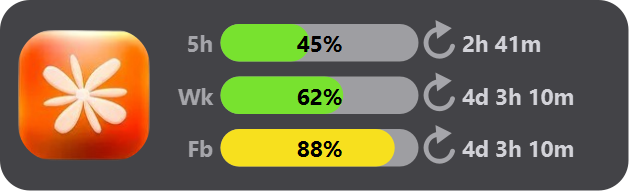

# Claude Usage Widget (Windows)

> by **[piyorotw](https://github.com/piyorotw)**

วิดเจ็ตเล็ก ๆ ลอยชิดเหนือ taskbar โชว์การใช้งาน **Claude Code** แบบเรียลไทม์ — โลโก้ + 3 แถว:
**5h** (รอบ 5 ชม.), **Wk** (สัปดาห์ ทุกโมเดล), **Fb** (สัปดาห์ เฉพาะโมเดล) แต่ละแถวมีแถบ
เปอร์เซ็นต์ (เขียว/เหลือง/แดง) + เวลานับถอยหลังรอบ reset. รองรับหลายจอ · ปรับขนาด/ตำแหน่งสดได้



## แหล่งข้อมูล
- **API (กดโลโก้เพื่ออัปเดต)** → `GET https://api.anthropic.com/api/oauth/usage` ด้วย token ของ
  Claude Code (`~/.claude/.credentials.json`) — ได้ **ครบ 3 แถว** แม่นยำ. endpoint นี้ถูก
  rate-limit เข้มมาก **จึงไม่ยิงอัตโนมัติ** — คลิก **โลโก้** บนวิดเจ็ตเมื่ออยากอัปเดต (`usage_api.py`
  เก็บผลล่าสุดไว้ + เว้น 60 วิ ถ้าเพิ่งโดน 429). ปิดได้ด้วย `"use_api": false`
- **สำรอง** ถ้ายังไม่เคยกดสำเร็จ → ประมาณจาก token ใน `~/.claude/projects/**` (แสดง `~` = ค่าประมาณ)

## อัปเดตตัวเลข
**คลิกที่โลโก้** 🟠 บนวิดเจ็ต → โลโก้จะหรี่ลงชั่วครู่ (กำลังดึง) แล้วตัวเลขจะอัปเดตเป็นค่าจริง
(ถ้าเพิ่งโดน rate limit จะเว้นสักครู่ค่อยกดใหม่ได้)

> **เรื่อง token/ความเป็นส่วนตัว:** วิธี (1) อ่าน access token ของคุณเองในเครื่อง แล้วส่งไปที่
> **api.anthropic.com เท่านั้น** (ที่เดียวกับที่ Claude Code ใช้) — ไม่ส่งที่อื่น ไม่ log ไม่เขียนลงไฟล์
> ไอเดียมาจาก widget ของเพื่อน (macOS): github.com/PanithanNanti/claude-usage-widget

โลโก้ที่ใช้: `CCLogo.png` (วางไฟล์ไว้ในโฟลเดอร์นี้)

## ติดตั้ง (ครั้งแรก)
ต้องมี **Python 3.10+** และใช้ **Claude Code** ที่ login แล้วในเครื่อง (มี `~/.claude/.credentials.json`)
```powershell
git clone <your-repo-url> ; cd claude-usage-widget
python -m venv .venv
.venv\Scripts\python -m pip install -r requirements.txt
copy config.example.json config.json      # แล้วปรับ x/scale/จอ ตามใจ

# ทดสอบ data layer (พิมพ์ตัวเลขออกมา)
.venv\Scripts\python usage.py

# รันแถบ (มี console ไว้ดู error ตอนจูนตำแหน่ง)
.venv\Scripts\python main.py

# รันจริง (เงียบ + มี watchdog ปลุกกลับถ้าตาย) — ดับเบิลคลิกได้เลย
run.bat        หรือ   run.pyw

# ปิด
stop.bat
```

## กันหาย / กันตาย (สำคัญ)
Win11 shell บางทีซ่อนหรือ "ฆ่า" หน้าต่าง overlay ทิ้ง โปรเจกต์นี้กัน 3 ชั้น:
1. **self-heal** — ในโปรเซส ถ้าถูกซ่อน/ถูกทำลาย จะสร้างกลับเองใน ~2 วิ ([bar.py](bar.py) `ensure_visible`)
2. **watchdog** — โปรเซสนอก ([watchdog.pyw](watchdog.pyw)) ถ้าตัวแถบ crash ทั้งโปรเซส จะปลุกใหม่ให้
3. **single-instance** — named mutex กันเปิดซ้อน (รัน `run.bat` ซ้ำไม่ทำให้แถบซ้อนกัน)

ปิดให้สนิทใช้ **`stop.bat`** (สร้างไฟล์ `.stop` บอก watchdog ให้เลิก ไม่ปลุกกลับ)
ถ้าอะไรแปลก ๆ ดู log ที่ [statusbar.log](statusbar.log)

## จูนตำแหน่ง/ขนาด — แก้ `config.json`
```jsonc
{
  "refresh_seconds": 30,          // ดึงข้อมูลใหม่ทุกกี่วินาที
  "click_through": true,          // true = คลิกทะลุ (แนะนำ)
  "use_api": true,               // true = ดึงเลขจริงจาก API (แนะนำ), false = ใช้ค่าประมาณ
  "claude_ceilings": { "5h": 8000000, "wk": 50000000 },  // ใช้เฉพาะตอน use_api=false
  "monitors": [
    { "screen_index": 0, "x": 1100, "width": 360, "height": 110, "scale": 1.0, "y_offset": 0 }
  ]
}
```
- **`scale`** — 🔎 ตัวคูณขนาดทั้งวิดเจ็ต (1.0 = ปกติ, 1.3 = ใหญ่ขึ้น 30%, 0.8 = เล็กลง).
  ทุกอย่างสเกลตาม (โลโก้/แถบ/ตัวเลข). **ยึดมุมขวา-ล่าง** → ขยายแล้วโตไปทางซ้าย-บน อยู่มุมเดิม.
  ปรับสดได้ — เหมาะกับการหาขนาดที่พอดี
- `x` — ตำแหน่งขอบซ้ายของกล่องฐาน (px). **เลขน้อย = ซ้าย, เลขมาก = ขวา** (ขอบขวา = `x + width`)
- `width` / `height` — ขนาดฐาน (ก่อนคูณ `scale`); `x + width` ไม่ควรเกินความกว้างจอ
- `y_offset` — ขยับขึ้น(−)/ลง(+). ค่า `0` = ชิดเหนือ taskbar เห็นเต็ม; **ค่าบวกดันลงไปทับ
  taskbar แล้วแถวล่างจะโดนบัง** (Win11 วางทับบน taskbar ไม่ได้ ต้องอยู่เหนือ)
- `screen_index` — 0 = จอหลัก, 1 = จอที่สอง

> **จูนสด ๆ ได้เลย:** ระหว่างวิดเจ็ตรันอยู่ แก้ `config.json` แล้ว **เซฟ** — ขยับตามใน ~2 วิ ไม่ต้องรีสตาร์ต

## เปิดอัตโนมัติตอน login
มี shortcut **"Claude Status Widget"** อยู่ในโฟลเดอร์ Startup แล้ว (ชี้ไป `pythonw watchdog.pyw`
รันเงียบทุก login). **ปิด auto-start:** `Win + R` → `shell:startup` → ลบ shortcut นั้นทิ้ง.
สร้างใหม่: วาง shortcut ของ `run.bat`/`run.pyw` ในโฟลเดอร์เดียวกัน

## ปิดวิดเจ็ต
- **ปุ่ม X แดงมุมขวาบน** ของแต่ละวิดเจ็ต → ปิด**เฉพาะจอนั้น** (จออื่นยังอยู่). เปิดกลับทั้งหมดด้วย `run.bat`
- ปิดทั้งโปรแกรม → **`stop.bat`** (หรือกด X ให้ครบทุกจอ)
- อยากปิดจอไหนถาวร → เอา object ของจอนั้นออกจาก `monitors` ใน `config.json`

## หมายเหตุ
- วิดเจ็ตรับคลิกเฉพาะปุ่ม (โลโก้/X); ตั้ง `click_through: true` ถ้าอยากให้คลิกทะลุทั้งตัว (แต่จะกดปุ่มไม่ได้)
- Win11 ฝัง "ในตัว" taskbar ไม่ได้ (topmost แพ้ z-order, SetParent ก็โดน XAML บัง) จึงวาง
  **ลอยชิดเหนือ** taskbar แทน — เป็น topmost อยู่เหนือหน้าต่างอื่น
- ปิด: **`stop.bat`** (อย่า kill ใน Task Manager เพราะ watchdog จะปลุกกลับ)

## ความเป็นส่วนตัว / security
- access token ถูกอ่านจาก `~/.claude/.credentials.json` และส่งไป **api.anthropic.com เท่านั้น**
  (ที่เดียวกับที่ Claude Code ใช้) — ไม่ถูก log/พิมพ์/ส่งที่อื่น
- ตอน refresh token จะสำรอง `~/.claude/.credentials.json.bak` ไว้ก่อนเขียน (atomic) กันพลาด
- `config.json`, `*.log`, `.usage_cache.json` เป็นไฟล์ส่วนตัว — ถูก `.gitignore` ไว้แล้ว ไม่ขึ้น repo

## เครดิต
- ไอเดีย + วิธียิง API/refresh token มาจาก widget ของเพื่อนบน macOS (Übersicht):
  [PanithanNanti/claude-usage-widget](https://github.com/PanithanNanti/claude-usage-widget)
- โลโก้ `CCLogo.png` เป็นเครื่องหมายของ Claude Code / Anthropic

## License
[MIT](LICENSE)
